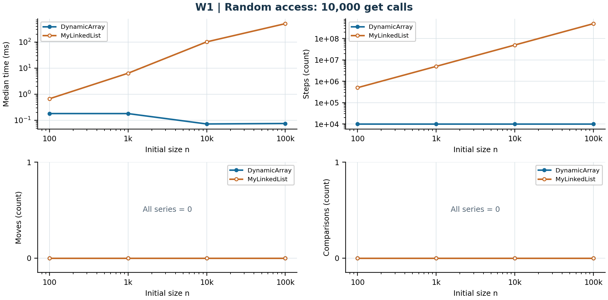
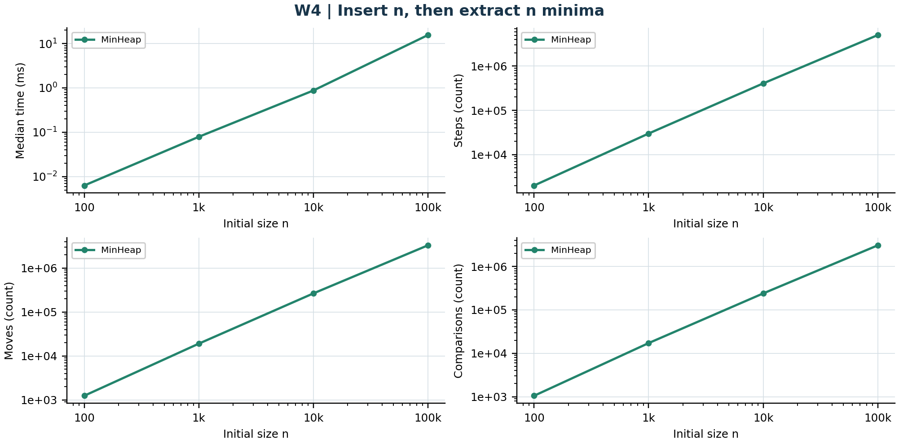
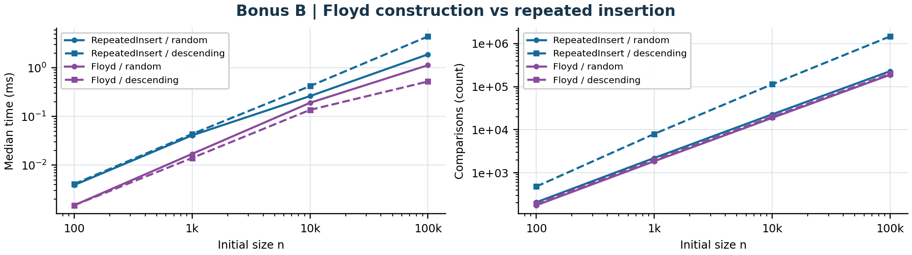

# In-Memory Workload Engine

Assignment 2 - Data StructuresAdilzhan Aliakbar | SE-2521 | 28 September 2026

Three implementations store primitive ints: a doubling dynamic array, a singly linked list with head and tail, and an array-based binary min-heap. Both sequences implement IntSequence. Production code uses no Java collection classes.

## 1. Complexity and storage

| Operation | Best | Average | Worst | Aux. Θ | Justification |
| --- | --- | --- | --- | --- | --- |
| Array: add(x) | Θ(1) | Θ(1)* | Θ(n) | 1 / n | Append; full capacity triggers doubling. |
| Array: add(i,x) | Θ(1) | Θ(n) | Θ(n) | 1 / n | Shift n-i values; may also grow. |
| Array: remove(i) | Θ(1) | Θ(n) | Θ(n) | 1 | Shift n-i-1 values; no shrinking. |
| Array: get(i) | Θ(1) | Θ(1) | Θ(1) | 1 | One direct cell read. |
| Array: contains(x) | Θ(1) | Θ(n) | Θ(n) | 1 | Scan to first match or end. |
| List: add(x) | Θ(1) | Θ(1) | Θ(1) | 1 | Tail pointer avoids traversal. |
| List: add(i,x) | Θ(1) | Θ(n) | Θ(n) | 1 | Endpoints fast; otherwise find i-1. |
| List: remove(i) | Θ(1) | Θ(n) | Θ(n) | 1 | Head fast; otherwise find predecessor. |
| List: get(i) | Θ(1) | Θ(n) | Θ(n) | 1 | Follow i next references from head. |
| List: contains(x) | Θ(1) | Θ(n) | Θ(n) | 1 | Inspect nodes until match or null. |
| Heap: insert(x) | Θ(1) | O(log n)* | Θ(n) | 1 / n | At most log n swaps; growth copies n. |
| Heap: peekMin() | Θ(1) | Θ(1) | Θ(1) | 1 | Read root at index zero. |
| Heap: extractMin() | Θ(1) | Θ(log n) | Θ(log n) | 1 | Replace root, descend; equal keys may stop early. |
| Heap: buildHeap(a) | Θ(n) | Θ(n) | Θ(n) | n | Copy input, then sift internal nodes bottom-up. |

Models: n ≥ 2; indexed operations average over uniform valid indices. Search averages use a constant miss fraction (50% in W2); heap extraction assumes random distinct priorities. The best heap extraction can be constant with equal keys. Invalid-input rejection is Θ(1).

* Growth and averages: for append/insert, the average is over calls in a growing sequence, including allocation costs (amortized), not the expected cost at a known full capacity. Array append has tight amortized Θ(1). Heap insert has amortized Ω(1) and O(log n), depending on key order; no tight statistical average is claimed. At a full capacity either insertion costs Θ(n).

Auxiliary space: 1 / n means Θ(1) without growth, Θ(n) during copying. The list retains Θ(n) nodes. The arrays retain Θ(capacity) cells; deletions do not shrink capacity, so storage need not be Θ(current n). Accessors and counter reset use Θ(1) time and space.

---

## 2. Loop-invariant proofs

### A. DynamicArray.contains(value)

Invariant. Before iteration i, 0 ≤ i ≤ size and no entry in data[0..i) equals value; the array is unchanged. Initialization. At i = 0 the inspected prefix is empty, so the statement is true.

Maintenance. The loop reads data[i]. If it equals value, returning true supplies an actual matching element. Otherwise data[i] is also different, so incrementing i preserves the invariant for the larger prefix. Termination. size-i decreases on every continuing iteration. Normal termination has i = size, so every stored element differs and false is correct. Conclusion. Both return paths satisfy the specification, including an empty array; counters do not modify the stored values.

### B. DynamicArray.remove(index)

Let k be the checked index, m the original size, and A the original logical array. The method saves A[k] before shifting. Invariant. Before iteration i: k ≤ i ≤ m-1; data[j] = A[j] for j < k; data[j] = A[j+1] for k ≤ j < i; and data[j] = A[j] for i ≤ j < m. The size remains m during the loop.

Initialization. i = k, so the shifted interval is empty and every cell still holds its original value. Maintenance. If i < m-1, data[i+1] is still A[i+1]. Assigning it to data[i] extends the shifted interval by one; incrementing i preserves the untouched suffix. Termination. m-1-i decreases to zero. At i = m-1, positions k through m-2 contain A[k+1] through A[m-1]. Decrementing size excludes the stale last cell. Conclusion. The method returns A[k], preserves order, and leaves exactly A without its k-th element; removing the last or only element correctly executes zero shift iterations.

## 3. Measurement method

Sizes are 100, 1,000, 10,000 and 100,000. Each size uses new Random(42); both sequences share the same values, indices and queries. W1 performs 10,000 gets. W2 shuffles 500 present values with 500 negative, guaranteed absent values. W3 performs all 1,000 insertions before 1,000 removals at 0 or the fixed original n/2. W4 inserts n values, then extracts n minima and validates non-decreasing output.

All paths receive 25 global warm-up passes at n = 1,000; each case then discards three additional runs and measures five fresh runs. The CSV reports their median batch time from System.nanoTime. Initial fill for W1-W3, data creation, validation and CSV output are excluded. W4 includes insertion and extraction; its output buffer is allocated beforehand. Checksums feed a volatile sink. Counters must match across all five samples; 180 raw workload samples preserve the evidence.

Counter model. A step is an array-cell read or traversal of one next link, including a terminal null. A move is an existing element relocation or an explicit structural head/tail/next assignment; a heap swap is two moves. New array-value placement and implicit initialization are excluded. Comparisons count stored int values only. Tests verify these conventions; counters are algorithm-level events, not CPU instructions or cache misses.

Measured environment: Java 25.0.4, OpenJDK 64-Bit Server VM; Windows 11 10.0, amd64; 12 visible logical processors; -Xms256m -Xmx1g. Run recorded at 2026-09-28T17:56:40.940559200Z. This is one JVM process on a shared workstation, not an isolated JMH study; short timings remain sensitive to JIT and scheduling.

---

## 4. Read and search workloads

Each figure shows median time and all three counters. The x-axis is logarithmic; time and positive counts use logarithmic y-axes. All-zero counter panels use a linear y-axis so zero operations remain visible.

Figure 1. W1 at n = 100,000: array 0.0748 ms and 10,000 reads; list 504.5790 ms and 502,489,208 link traversals. The fixed query count keeps array steps constant.

Figure 2. W2 at n = 100,000: array 53.5565 ms, list 95.1567 ms; both perform 75,354,742 comparisons. The list has exactly 500 fewer steps because each successful query returns without traversing past its matching node. Zero moves and coincident comparison curves are intentional.

---

## 5. Mutation and priority workloads

Figure 3. At n = 100,000, head edits take 32.1776 ms in the array versus 0.0109 ms in the list. List head edits require 1,000 traversals and 3,000 link updates, independent of initial n. For k = 1,000 and fixed index i, array moves are 2k(n-i)+k(k-1), plus any growth copies; array steps add k reads of removed values. Middle-list traversal is 1,000(n-1) for these even sizes.

Figure 4. At n = 100,000, priority processing takes 15.4917 ms with 5,036,704 steps, 3,290,753 moves and 3,060,796 comparisons. Only MinHeap belongs to W4. Random-input batch work grows on the n log n scale; resizing adds a linear total number of copies.

---

## 6. Discussion

DynamicArray computes a cell address directly, so W1 uses one array read per get while the singly linked list follows roughly n/2 links for a uniform random index. Sequential scans also favor an int array because adjacent values share contiguous storage and cache lines. This spatial locality makes hardware prefetching more effective than dependent pointer chasing. A list node is a separate object containing a header, an int and a next reference, with possible alignment padding. Its next address is learned from the current node, limiting independent memory accesses even when asymptotic work is the same. In W2 at n = 100,000 the comparison counts are identical, but the list takes 1.78 times the array time. Per-node allocations can also increase memory management and garbage-collection pressure, although this experiment does not measure GC pauses or cache misses directly. The list is the better choice for repeated head insertions/removals, as its link work is independent of n. Its tail pointer supports constant-time append, but deleting the last node still requires locating its predecessor. For middle edits at n = 100,000, the array takes 14.4602 ms versus the list's 98.7686 ms despite both performing linear work per edit. MinHeap is preferable for repeated minimum-priority scheduling: peek is constant time and extraction is logarithmic in the worst case. For index-heavy or scan-heavy data, the array is preferable; measured constants should still be interpreted with the JVM warm-up, instrumentation and machine-load limitations in mind.

## 7. Bonus B: Floyd's bottom-up buildHeap

Leaves already satisfy the heap property; process internal nodes from n/2-1 down to zero. A node of height h costs O(h), and at most O(n/2^(h+1)) nodes have that height. Thus total sift work is O(n Σ h/2^h) = O(n); copying every input value gives Ω(n), hence Θ(n). Repeated insertion has Θ(n log n) worst-case work on descending input, but random insertion can show nearly linear comparison growth.

Figure 5. At n = 100,000, random-input comparisons: Floyd 188,488 versus inserts 228,896; descending-input comparisons: 199,978 versus 1,468,946. Descending times: 0.5267 ms versus 4.4540 ms. Both methods include construction only; validation is excluded.

Validation and reproducibility. 39 JUnit 5 tests passed, with no failures, errors or skipped tests. CSV checks confirm every required case and exact medians from five samples. README documents execution and the local Git history with four feature branches, main and v1.0; GitHub publication is still pending. The optional JOL memory-footprint bonus was not attempted.
